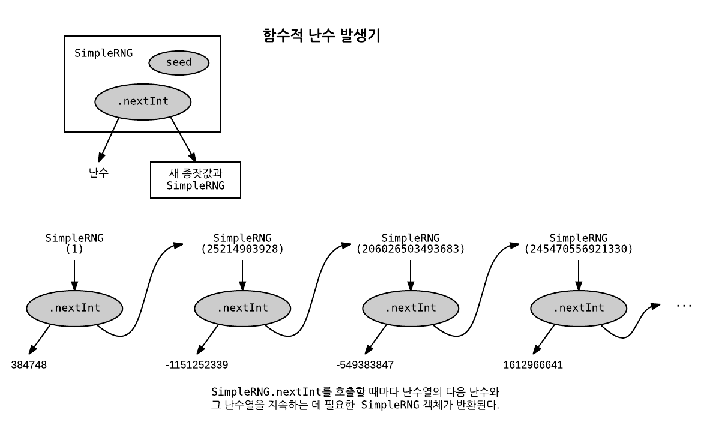

# 6장. 순수 함수적 상태

임의의 상태 있는(stateful) API를 순수 함수적으로 만드는데 쓰이는 기본 패턴을 익힌다.

## 6.1 부수 효과를 이용한 난수 발생

부수 효과에 의존하는 전형적인 명령식(imperative) API, `scala.util.Random`

```
scala> val rng = new scala.util.Random
rng: util.Random = scala.util.Random@7112b21a

scala> rng.nextDouble
res1: Double = 0.4281408614601089

scala> rng.nextDouble
res2: Double = 0.4014911461191124

scala> rng.nextInt
res3: Int = -1211411832

scala> rng.nextInt(10) // 0 이상 9 이하의 정수 난수
res4: Int = 9
```

난수 발생기(random number generator, RNG) 객체 rng에는 메서드 호출 때마다 갱신되는 내부 상태가 존재한다. 상태 갱신은 부수 효과로서 수행되므로 이 메서드들은 참조에 투명하지 않으며, 검사, 합성, 모듈화가 어렵고, 쉽게 병렬화할 수 없다.

##### 무작위성에 대한 재현성(reproducibility)

```scala
// 1 이상 6 이하의 정수를 돌려주는 육면체 주사위 굴림에 대한 메서드
def rollDie: Int = {
  val rng = new scala.util.Random
  rng.nextInt(6) // 0 이상 5 이하의 난수
```

- expected: 1 이상 6 이하
- actual: 0 이상 5 이하

`rollDie`의 구현에는 하나 모자라는 오류(off-by-one error)가 있지만 여섯 번 중 다섯 번은 검사에 통과한다. 

## 6.2 순수 함수적 난수 발생

상태 갱신을 **명시적으로** 드러냄으로써 참조 투명성을 확보할 수 있다.

```scala
trait RNG {
  def nextInt: (Int, RNG)
}
```

이 메서드는 제자리(in-place) **변이**를 통해 내부 상태를 갱신하는 대신, 난수와 함께 새 상태를 가진 새로운 `RNG`를 돌려준다. **다음 상태를 계산**하는 것과 **새 상태를 알려주는** 두 관심사를 분리한 형태이다. API 사용자가 난수 발생기 자체의 구현에 대해서는 모른다는 점에서 상태는 발생기 안에 **캡슐화**되어 있다.



##### 선형 합동 발생기([linear congruential generator](https://en.wikipedia.org/wiki/Linear_congruential_generator))

```scala
case class SimpleRNG(seed: Long) extends RNG {
  def nextInt: (Int, RNG) = {
    val newSeed = (seed * 0x5DEECE66DL + 0xBL) & 0xFFFFFFFFFFFFL
    val nextRNG = SimpleRNG(newSeed)
    val n = (newSeed >>> 16).toInt
    (n, nextRNG)
  }
}
```

- `&`: 비트 단위 논리곱(AND) 연산
- `>>>`: 빈자리를 0으로 채우는 이진 오른쪽 자리이동(binary shift right) 연산자

위 함수는 여러번 실행해도 항상 같은 값이 나온다. *즉, `SimpleRNG.nexInt`는 순수하다.*

```
scala> val rng = SimpleRNG(42)
rng: SimpleRNG = SimpleRNG(42L)

scala> val (n1, rng2) = rng.nextInt
n1: Int = 16159453
rng2: RNG = SimpleRNG(1059025964525)

scala> val (n2, rng3) = rng2.nextInt
n2: Int = -1281479697
rng3: RNG = SimpleRNG(197491923327988)
```

## 6.3 상태 있는 API를 순수하게 만들기

```scala
class Foo {
  private var s: FooState = ...
  def bar: Bar
  def baz: Int
}
```

`bar`와 `baz`가 `s`를 변이한다고 할 때, 이 API를 순수 함수적 API로 변환할 수 있다.

```scala
trait Foo {
  def bar: (Bar, Foo)
  def baz: (Int, Foo)
}
```

이와 같은 패턴은 다음 상태에 대한 처리를 호출자에게 넘긴다.

```scala
def randomPair(rng: RNG): (Int, Int) = {
  val (i1, _) = rng.nextInt
  val (i2, _) = rng.nextInt
  (i1, i2)
}
```

위 예제에서 `rng`의 재사용으로 인해 `i1`과 `i2`의 값은 항상 같다. 서로 다른 두 수를 만들려면, 첫 `nextInt` 호출이 돌려준 `RNG`를 이용해서 두번째 값을 만들어야 한다.

```scala
def randomPair(rng: RNG): ((Int, Int), RNG) = {
  val (i1, rng2) = rng.nextInt
  val (i2, rng3) = rng2.nextInt
  ((i1, i2), rng3)
}
```

###### ■ 연습문제 6.1

> RNG.nextInt를 이용해서 0 이상, Int.MaxValue 이하의 난수 정수를 생성하는 함수를 작성하라. nextInt가 Int.MinValue를 돌려주는 구석진 경우(음이 아닌 대응수가 없다)도 확실하게 처리해야 한다.
> 
> `def nonNegativeInt(rng: RNG): (Int, RNG)`

###### ■ 연습문제 6.2

> 0 이상, 1 미만의 Double 난수를 발생하는 함수를 작성하라. 참고: 최대의 양의 정수를 얻으려면 Int.MaxValue를, x: Int를 Double로 변환하려면 x.toDouble을 사용하면 된다.
> 
> `def double(rng: RNG): (Double, RNG)`

###### ■ 연습문제 6.3

> 각각 난수쌍 (Int, Double) 하나, (Double, Int) 하나, 3튜플 (Double, Double, Double) 하나를 발생하는 함수들을 작성하라. 앞에서 작성한 함수들을 재사용할 수 있어야 한다.
> 
> `def intDouble(rng: RNG): ((Int, Double), RNG)`
> `def doubleInt(rng: RNG): ((Double, Int), RNG)`
> `def double3(rng: RNG): ((Double, Double, Double), RNG)`

###### ■ 연습문제 6.4

> 정수 난수들의 목록을 생성하는 함수를 작성하라.
> 
> `def ints(count: Int)(rng: RNG): (List[Int], RNG)`

##### 함수형 프로그래밍의 어색함 극복

> 프로그램을 함수적으로 표현하는 것이 지금과 같이 어색하거나 지겨운 상황에 처하기도 한다. 이런 어색함은 아직 뭔가를 덜 추상화했기 때문에 비롯된 것이다. 코드에서 추출할 수 있는 공통 패턴을 찾아보고 경험해보면 프로그램을 함수적으로 표현하기가 수월하고 자연스러워질 것이다. 설계를 잘하는 것은 어려운 일이지만 순수 함수를 이용한 프로그래밍은 설계 공간을 크게 단순화한다.


## 6.4 상태 동작을 위한 더 나은 API

앞의 구현에서, 모든 함수가 임의의 `A`에 대해 `RNG => (A, RNG)` 형태의 형식을 사용한다는 공통의 패턴을 발견할 수 있다. 이런 종류의 함수를 **상태 동작(state action)** 또는 **상태 전이(state transition)**라고 부른다. 이 상태 동작들을 이번에 살펴볼 고차 함수인 **조합기(combinator)**를 이용해서 조합할 수 있다.

다음은 `RNG` 상태 동작 자료 형식에 대한 형식 별칭(alias)이다.

```scala
type Rand[+A] = RNG => (A, RNG)
```

`Rand[A]` 형식은 입력받은 `RNG`를 이용해 `A`를 생성하고 `RNG`를 새로운 상태로 전이하는 하나의 프로그램이다. `RNG`의 `nextInt`같은 메서드를 이 새로운 형식의 값으로 만들 수 있다.

```scala
val int: Rand[Int] = _.nextInt
```

`Rand` 동작을 조합하되 그 상태를 명시적으로 전달하지 않아도 되는 조합하는 것이 가능하다. 다음은 주어진 `RNG`를 사용하지 않고 그대로 전달하는, 가장 간단한 형태의 `RNG` 상태 전이인 `unit` 동작이다.

```scala
def unit[A](a: A): Rand[A] =
  rng => (a, rng)
```

상태 동작의 출력을 변환하되 상태 자체는 수정하지 않는 `map`은 다음과 같다.

```scala
def map[A, B](s: Rand[A])(f: A => B): Rand[B] =
  rng => {
    val (a, rng2) = s(rng)
    (f(a), rng2)
  }
```

`map`을 사용하여 0보다 크거나 같고 2로 나누어지는 Int를 발생하는 `nonNegativeEven` 함수를 작성할 수 있다.

```scala
def nonNegativeEven: Rand[Int] =
  map(nonNegativeInt)(i => i - i % 2)
```

###### ■ 연습문제 6.5

> 연습문제 6.2의 double을 map을 이용해서 좀 더 우아한 방식으로 구현하라.

###### What is the difference between “def” and “val” to define a function

> `val` evaluates when defined.
> 
> `def` evaluates on every call, so performance could be worse then with val for multiple calls. You'll get the same performance with a single call. And with no calls you'll get no overhead from def, so you can define it even if you will not use it in some branches.
> 
> With a `lazy val` you'll get a lazy evaluation: you can define it even if you will not use it in some branches, and it evaluates once or never, but you'll get a little overhead from double check locking on every access to your `lazy val`.
> 
> [http://stackoverflow.com/a/18887341](http://stackoverflow.com/a/18887341)

### 6.4.1 상태 동작들의 조합

###### ■ 연습문제 6.6

> 다음과 같은 서명에 따라 map2를 구현하라. 이 함수는 두 상태 동작 ra 및 rb와 이들의 결과를 조합하는 함수 f를 받고 두 동작을 조합한 새 동작을 돌려준다.
> 
> `def map2[A, B, C](ra: Rand[A], rb: Rand[B])(f: (A, B) => C): Rand[C]`

`map2`를 이용하면 `A`와 `B` 형식의 값을 발생하는 동작을 조합해서 `A`와 `B`의 쌍을 발생하는 동작을 얻을 수 있다.

```scala
def both[A, B](ra: Rand[A], rb: Rand[B]): Rand[(A, B)] =
  map2(ra, rb)((_, _))
```

`both`를 이용해서 연습문제 6.3의 `intDouble`과 `doubleInt`를 간결하게 구현할 수 있다.

```scala
val randIntDouble: Rand[(Int, Double)] =
  both(int, double)

val randDoubleInt: Rand[(Double, Int)] = 
  both(double, int)
```

###### ■ 연습문제 6.7

> **어려움**: 두 RNG 상태 전이를 조합할 수 있다면, 그런 상태 전이들의 목록 전체를 조합하는 것도 가능해야 마땅하다. 상태 전이들의 List를 하나의 상태 전이로 조합하는 함수 sequence를 구현하라. 그리고 이 함수를 이용해서 이전에 작성한 ints 함수를 다시 구현하라. ints 함수의 구현에서 x가 n번 되풀이되는 목록을 만들 일이 있으면 표준 라이브러리 함수 List.fill(n)(x)를 사용해도 좋다.
> 
> `def sequence[A](fs: List[Rand[A]]): Rand[List[A]]`

### 6.4.2 내포된 상태 동작

지금까지 예에서의 보여진 하나의 패턴을 잘 추출하면 `RNG` 값을 명시적으로 언급하거나 전달하지 않는 구현이 가능하다. 조합기 `map`과 `map2` 덕분에, 작성하기 지루하고 실수의 여지가 많던 함수를 좀 더 간결하고 우아하게 구현할 수 있게 되었다. 

그러나 0 이상, n 미만의 정수 난수를 발생하는 `nonNegativeLessThan` 함수는 `map`과 `map2`로는 잘 작성할 수 없다.

`def nonNegativeLessThan(n: Int): Rand[Int]`

음이 아닌 정수를 `n`으로 나눈 나머지를 돌려주는 방법을 사용할 수도 있지만, `Int.MaxValue`가 `n`으로 나누어떨어지지 않을 수 있으므로 결과가 나눗셈의 나머지보다 작은 수들로 치우치게 된다.

```scala
def nonNegativeLessThan(n: Int): Rand[Int] = 
  map(nonNegativeInt) { _ % 2 }
```

따라서, nonNegativeInt가 32비트 정수를 벗어나지 않는 n의 최대 배수보다 큰 수를 발생했다면 더 작은 수가 나오길 바라면서 발생기를 다시 시도해야 한다.

```scala
def nonNegativeLessThan2(n: Int): Rand[Int] =
  map(nonNegativeInt) { i =>
    val mod = i % 2
    if (i + (n - 1) - mod >= 0) mod else nonNegativeLessThan2(n)(???)
  }
```

```scala
def nonNegativeLessThan(n: Int): Rand[Int] = { rng =>
  val (i, rng2) = nonNegativeInt(rng)
  val mod = i % n
  if (i + (n - 1) - mod >= 0)
    (mod, rng2)
  else nonNegativeLessThan(n)(rng2)
}
```